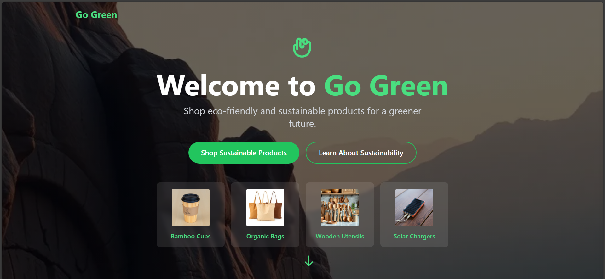

# 🌿 Go Green – Eco-Friendly Products Store

A sustainable e-commerce React application that showcases eco-friendly products, complete with animated UI, cart functionality, and a beautiful modern design using **Tailwind CSS**.

## ✨ Features

- 💚 Hero section with animated headings and call-to-action
- 🛒 Product listing with **Add to Cart** functionality
- 📦 Cart icon with live item count badge
- 🔍 Search input field (UI only)
- 🎨 Fully responsive design with Tailwind CSS
- 🌱 About page describing the mission and values of Go Green
- 📄 Annual Report section
- 📱 Social media & contact links in the footer

## 📸 Screenshots
- 🏡 Homepage / Hero Section


-🛍️ Product Listing & Cart Icon


- 🧑‍🤝‍🧑 About Us Section
  
  ## 🚀 Getting Started
---

## 🚀 Getting Started

### 1. Clone the repository

```bash
git clone https://github.com/your-username/go-green-store.git
cd go-green-store
```

### 2. Install dependencies

```bash
npm install
```

### 3. Start the development server

```bash
npm run dev
```

➡️ Visit your app at: [http://localhost:5173](http://localhost:5173)

---

## 📁 Folder Structure

```
go-green-store/
│
├── public/              # Static assets
├── src/
│   ├── components/      # React components
│   ├── pages/           # Pages like Home, About, ProductList
│   ├── context/         # Auth context (Firebase or custom)
│   └── App.jsx          # Main app
│
├── README.md
└── package.json
```

---

## 📦 Tech Stack

- ⚛️ React
- ⚡ Vite
- 🎨 Tailwind CSS
- 🔥 Firebase (optional, for Auth/DB)
- 🛠️ Heroicons & React Icons

---

## 🧑‍💻 Contributing

Pull requests are welcome! For major changes, open an issue first to discuss.

